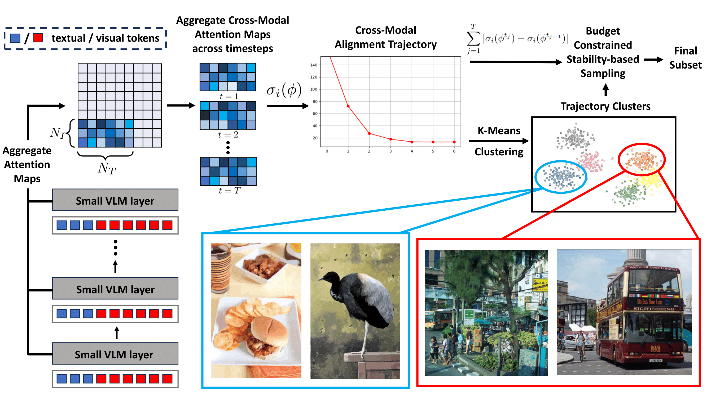

# XMAS


This repository is the official implementation of our paper: "**Data Selection or Fine-Tuning Vision Language Models via Cross Modal Attention Trajectories**".

## Overview
Data-efficient learning aims to eliminate redundancy in large training datasets by training models on smaller subsets of the most informative examples. While data selection has been extensively explored for vision models and large language models (LLMs), it remains underexplored for Large Vision-Language Models (LVLMs). 
Notably, none of existing methods can outperform random selection at different subset sizes.
In this work, we propose the first principled method for data-efficient instruction tuning of LVLMs. We prove that examples with similar cross-modal attention matrices during instruction tuning have similar gradients. Thus, they influence model parameters in a similar manner and convey the same information to the model during training. Building on this insight, we propose XMAS, which clusters examples based on the trajectories of the top singular values of their attention matrices obtained from fine-tuning a small proxy LVLM. By sampling a balanced subset from these clusters, XMAS effectively removes redundancy in large-scale LVLM training data. Extensive experiments show that XMAS can discard 50\% of the LLaVA-665k dataset and 85\% of the Vision-Flan dataset while fully preserving performance of LLaVA-1.5-7B %to match the accuracy of full-data training on 10 downstream benchmarks and speeding up its training by 1.2$\times$. This is 30\% more data reduction  compared to the best baseline for LLaVA-665k.

[Project Page](https://bigml-cs-ucla.github.io/XMAS-project-page/)

[Paper](https://github.com/BigML-CS-UCLA/XMAS/tree/main)



<p>
XMAS employs a small proxy VLM to find alignment trajectory for examples in the fine-tuning data. Examples with similar alignment trajectory have similar gradients during instruction tuning. Then, it clusters the alignment trajectories and sample a balanced subset of examples with more stable trajectories from the clusters.
</p>

## Table of Contents


## Installation
Since we use different models for 1. selection and 2. training, different environments are required for each process.

### Selection
```shell
conda create -n xmas python=3.10 -y
conda activate xmas
cd XMAS
pip install --upgrade pip  # enable PEP 660 support
pip install -e .
```
Additional packages
```shell
pip install flash-attn==2.6.3 --no-build-isolation
conda install -c pytorch -c nvidia faiss-gpu=1.9.0
```

### Training
```shell
conda create -n llava python=3.10 -y
conda activate llava
cd LLaVA
pip install --upgrade pip  # enable PEP 660 support
pip install -e .
pip install -e ".[train]"
pip install flash-attn==2.7.2.post1 --no-build-isolation
```

## Usage

### Downloading datasets
Use the instructions listed on the following links for downloading datasets and make sure to structure them as mentioned.

- LLaVA Mix-665K instruction-tuning dataset - [here](https://github.com/haotian-liu/LLaVA?tab=readme-ov-file#visual-instruction-tuning)
- Vision FLAN dataset - [here](https://vision-flan.github.io/#download)


### Runnning XMAS
Naviage to the correct path and activate the environment:
```shell
cd XMAS
conda activate xmas
```
Following are the main steps in XMAS:

#### Launch Training of proxy model:
Set the `FINETUNE_DATA_PATH` and `FINETUNE_IMAGE_PATH` in `scripts/train/train_stablelm.sh` and run the following command.
```shell
bash scripts/train/train_stablelm.sh
```

#### Collect the cross attention trajectories of the proxy model
Set the `FINETUNE_DATA_PATH` and `FINETUNE_IMAGE_PATH` in `scripts/inference/get_trajectory.sh`.
Then run the following command to compute metrics (`attn_svd` or `loss`) for each checkpoint.
```shell
bash scripts/inference/get_distributed_trajectories.sh
```

#### Clustering the Trajectories
Get a desired budget by setting `BUDGET` in `scripts/inference/cluster_and_sample.sh`.
Set `DATA_PATH` to be actual path of the annotation file of your dataset (LLaVA mix665k or Vision-Flan) in `scripts/inference/cluster_and_sample.sh` and then run the following command:
```shell
bash scripts/inference/clusster_and_sample.sh
```
The above will create a subset of the finetuning dataset of the required size that will get saved under `LLaVA/selected_data`. Use this for fine tuning target model by first setting the correct path to annotation file and then run the following:
```shell
bash scripts/v1_5/finetune_lora.sh
```

## License

This project is licensed under the MIT License. See the [LICENSE](LICENSE) file for details.

## BibTex
```
@misc{naharas2025dataselectionfinetuningvision,
      title={Data Selection for Fine-tuning Vision Language Models via Cross Modal Alignment Trajectories}, 
      author={Nilay Naharas and Dang Nguyen and Nesihan Bulut and Mohammadhossein Bateni and Vahab Mirrokni and Baharan Mirzasoleiman},
      year={2025},
      eprint={2510.01454},
      archivePrefix={arXiv},
      primaryClass={cs.CV},
      url={https://arxiv.org/abs/2510.01454}, 
}
```

